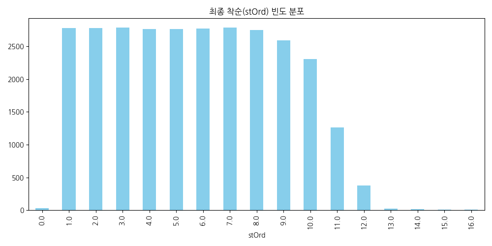
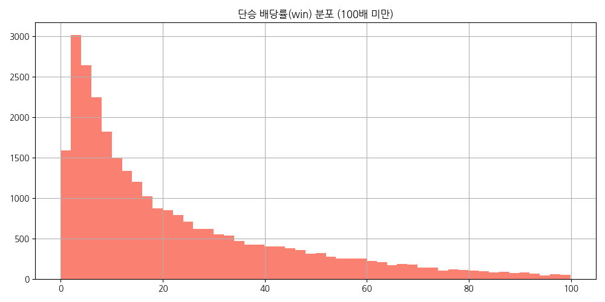
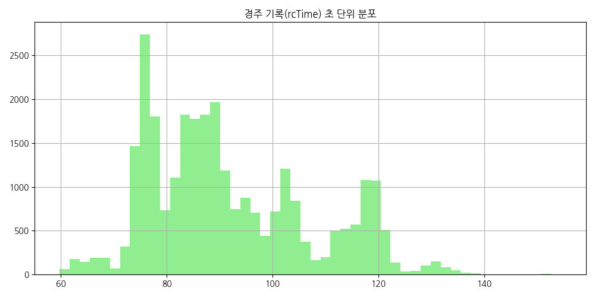
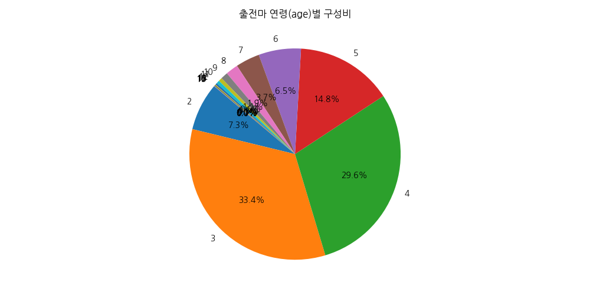
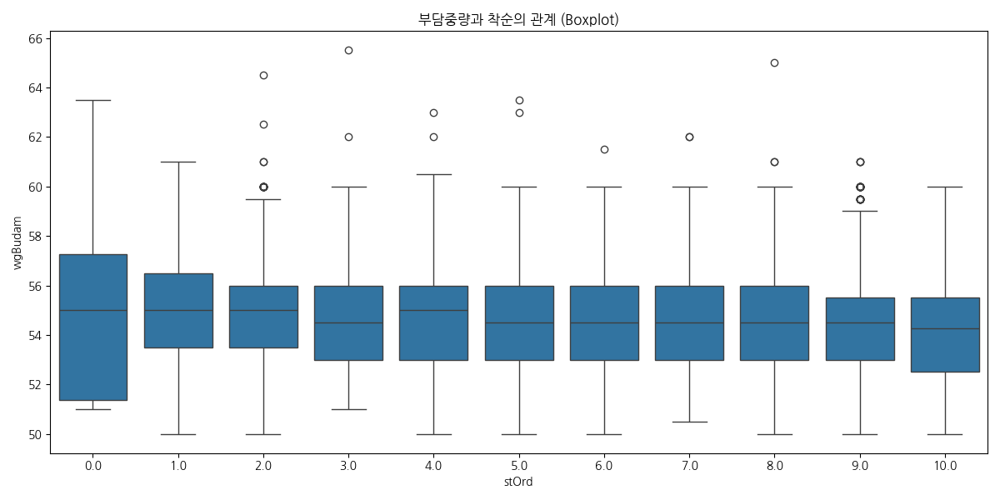
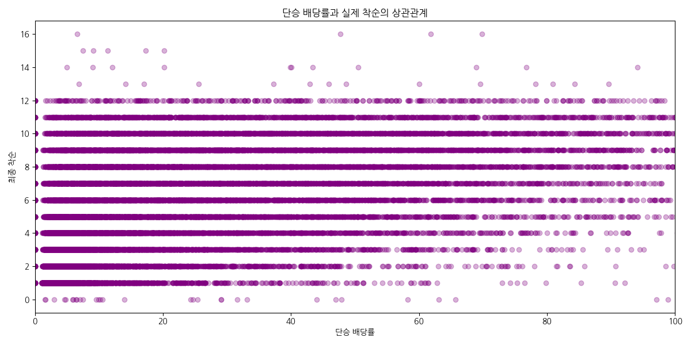
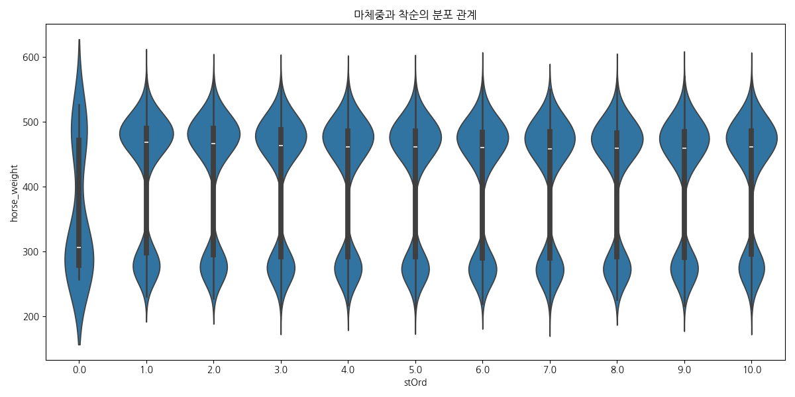
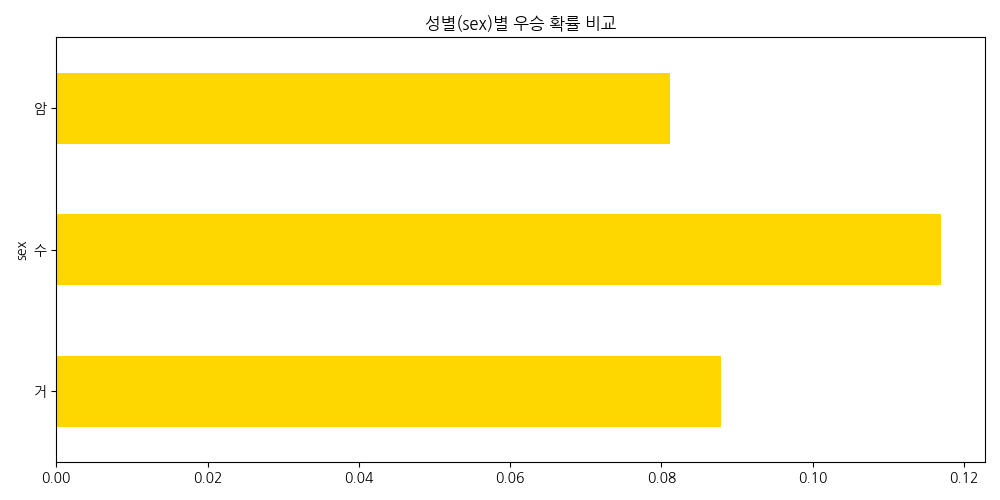
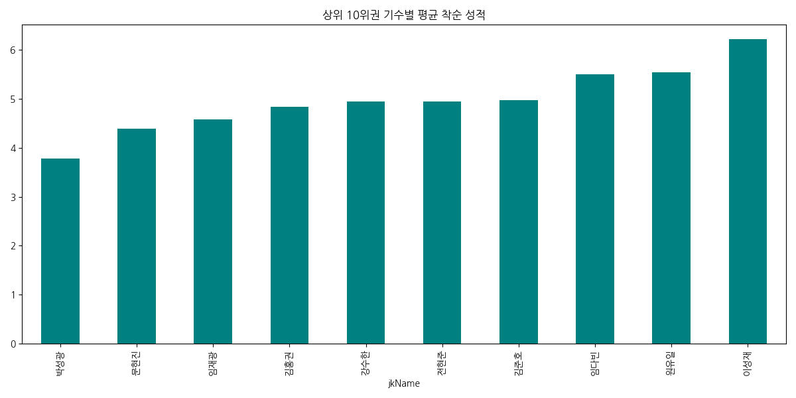

# 경주 상세 성적 데이터 (API227) 심층 분석 리포트

- **분석 기간**: 2025.03 - 2026.03

- **작성 일자**: 2026-04-06 23:22

- **역할**: 20년 차 시니어 데이터 분석가 에이전트


## 1. 데이터 구조 진단 (Diagnosis)

### 1.1 데이터 요약

- 전체 데이터 셰이프 (Shape): `(29414, 36)`

### 1.2 상위 5개 행 (head)

```text
   age  chulNo  chulYn  df  differ  hrName   hrNo  hrRating         hrTool  jkMeet jkName    jkNo jkSymbol meet owCloth owName    owNo   plc prdCtyNm    rcDate  rcNo  rcTime sex  stOrd  trMeet trName    trNo  wgBudam  wgHr   win  horse_weight  horse_weight_delta   rcDate_dt  meet_nm  is_winner  is_place
0    3       1       0   1     NaN    위즈골드  50982         0       계란형큰,망사눈       1    씨씨웡  080613        -   서울       ♠    최몽주  111028   2.5        한  20250301     1    79.4   암    8.0       1    박지헌  070264     54.0   487  14.6         487.0                 0.0  2025-03-01      NaN      False     False
1    3       2       0  -3     3.0  이클립스탱고  51112         0           양털코+       1    푸르칸  080611        -   서울       ♠    조한수  122023  13.1        한  20250301     1    77.5   수    4.0       1    서홍수  070160     56.0   482  54.0         482.0                 0.0  2025-03-01      NaN      False     False
2    3       3       0  18     2.0   최강스피드  51367         0  Triabit +,망사눈       1     코지  080617        -   서울       ♠    박남성   10496   5.2        한  20250301     1    77.8   수    5.0       1    전승규  070182     56.0   492  25.6         492.0                 0.0  2025-03-01      NaN      False     False
3    3       4       0  -6     3.0   선더파이어  50852         0        계란형큰,망사       1    조인권  080438        -   서울       ♠    변갑한  109014   1.2        한  20250301     1    76.9   수    3.0       1    함완식  070248     56.0   468   3.3         468.0                 0.0  2025-03-01      NaN      False      True
4    3       5       0   2     NaN   은파스위트  51864         0            망사+       1    조상범  080533        -   서울       ♠    이미경  105161   3.8        한  20250301     1    79.1   암    7.0       1    이신우  070167     54.0   419  32.7         419.0                 0.0  2025-03-01      NaN      False     False
```

### 1.3 하의 5개 행 (tail)

```text
       age  chulNo  chulYn  df  differ hrName   hrNo  hrRating           hrTool  jkMeet jkName    jkNo jkSymbol meet owCloth owName    owNo   plc prdCtyNm    rcDate  rcNo  rcTime sex  stOrd  trMeet trName    trNo  wgBudam  wgHr   win  horse_weight  horse_weight_delta   rcDate_dt  meet_nm  is_winner  is_place
29409    5       7       0  -8     2.0  포켓밀리언  47369        44          계란형큰,망사       3    유광희  080483        -   부경       ♠    이종훈  105127   6.9        한  20260329     7   119.6   암   10.0       3    양영남  070263      NaN   471  50.2         471.0                 0.0  2026-03-29      NaN      False     False
29410    6       8       0  -7     NaN   대호나라  46218        56       계란형큰,망사,혀끈       3    김어수  080403        -   부경       ♠    고재완  105119   2.3        한  20260329     7   117.5   암    6.0       3    강은석  070223      NaN   450  15.2         450.0                 0.0  2026-03-29      NaN      False     False
29411    5       9       0   0     NaN   세광최강  47183        51          망사,반가지큰       3    최은경  080566        -   부경       ♠    배형진  123014   8.8        한  20260329     7     NaN   암    NaN       3    이정표  070132      NaN   451  66.7         451.0                 0.0  2026-03-29      NaN      False     False
29412    7      10       0   4     NaN    무등산  46079        51  망사눈,반가지큰,자극판,혀끈       3    서강주  080605        -   부경       ♠   희망홀스  121052  13.0        미  20260329     7   117.5   거    7.0       3    강은석  070223      NaN   509  78.5         509.0                 0.0  2026-03-29      NaN      False     False
29413    6      11       0   1     3.0   가속제일  45628        51               망사       3    이성재  080431        -   부경       ♠    김정두   65066   2.9        한  20260329     7   118.0   수    8.0       3    이정표  070132      NaN   503  13.4         503.0                 0.0  2026-03-29      NaN      False     False
```

### 1.4 데이터 정보 (info)

```text
<class 'pandas.DataFrame'>
RangeIndex: 29414 entries, 0 to 29413
Data columns (total 36 columns):
 #   Column              Non-Null Count  Dtype  
---  ------              --------------  -----  
 0   age                 29414 non-null  int64  
 1   chulNo              29414 non-null  int64  
 2   chulYn              29414 non-null  int64  
 3   df                  29414 non-null  int64  
 4   differ              11321 non-null  float64
 5   hrName              29414 non-null  str    
 6   hrNo                29414 non-null  int64  
 7   hrRating            29414 non-null  int64  
 8   hrTool              29414 non-null  str    
 9   jkMeet              29414 non-null  int64  
 10  jkName              29414 non-null  str    
 11  jkNo                29414 non-null  str    
 12  jkSymbol            29414 non-null  str    
 13  meet                29414 non-null  str    
 14  owCloth             29414 non-null  str    
 15  owName              29414 non-null  str    
 16  owNo                29414 non-null  int64  
 17  plc                 29414 non-null  float64
 18  prdCtyNm            29414 non-null  str    
 19  rcDate              29414 non-null  int64  
 20  rcNo                29414 non-null  int64  
 21  rcTime              28775 non-null  float64
 22  sex                 29414 non-null  str    
 23  stOrd               28806 non-null  float64
 24  trMeet              29414 non-null  int64  
 25  trName              29414 non-null  str    
 26  trNo                29414 non-null  str    
 27  wgBudam             26346 non-null  float64
 28  wgHr                29414 non-null  int64  
 29  win                 29414 non-null  float64
 30  horse_weight        29414 non-null  float64
 31  horse_weight_delta  29414 non-null  float64
 32  rcDate_dt           29414 non-null  str    
 33  meet_nm             0 non-null      float64
 34  is_winner           29414 non-null  bool   
 35  is_place            29414 non-null  bool   
dtypes: bool(2), float64(9), int64(12), str(13)
memory usage: 10.3 MB

```

### 1.5 자료형 (dtypes)

```text
age                     int64
chulNo                  int64
chulYn                  int64
df                      int64
differ                float64
hrName                    str
hrNo                    int64
hrRating                int64
hrTool                    str
jkMeet                  int64
jkName                    str
jkNo                      str
jkSymbol                  str
meet                      str
owCloth                   str
owName                    str
owNo                    int64
plc                   float64
prdCtyNm                  str
rcDate                  int64
rcNo                    int64
rcTime                float64
sex                       str
stOrd                 float64
trMeet                  int64
trName                    str
trNo                      str
wgBudam               float64
wgHr                    int64
win                   float64
horse_weight          float64
horse_weight_delta    float64
rcDate_dt                 str
meet_nm               float64
is_winner                bool
is_place                 bool
```

### 1.6 결측치 (Missing values)

```text
         Counts  Ratio(%)
differ    18093     61.51
rcTime      639      2.17
stOrd       608      2.07
wgBudam    3068     10.43
meet_nm   29414    100.00
```

### 1.7 중복 데이터 (Duplicates)

- 중복 행 수: `636`

### 1.8 변수 분류

- **날짜형**: 

- **수치형**: age, chulNo, chulYn, df, differ, hrNo, hrRating, jkMeet, owNo, plc, rcDate, rcNo, rcTime, stOrd, trMeet, wgBudam, wgHr, win, horse_weight, horse_weight_delta, meet_nm

- **범주형**: hrName, hrTool, jkName, jkNo, jkSymbol, meet, owCloth, owName, prdCtyNm, sex, trName, trNo, rcDate_dt

### 1.9 데이터셋 특성 요약

> 본 데이터셋은 한국마사회의 경주 상세 데이터를 포함하며, 2025.03~2026.03 기간의 풍부한 시계열성을 담고 있습니다. 수치형 변수인 부담중량, 마체중, 배당률과 범주형 변수인 기수, 조교사 정보를 통해 순위(stOrd)를 예측하는 데 최적화되어 있습니다.


## 2. 기술통계 (Descriptive Statistics)

### 2.1 수치형 데이터 요약

```text
                age        chulNo        chulYn            df        differ          hrNo      hrRating        jkMeet           owNo           plc        rcDate          rcNo        rcTime         stOrd        trMeet       wgBudam          wgHr           win  horse_weight  horse_weight_delta  meet_nm
count  29414.000000  29414.000000  29414.000000  29414.000000  11321.000000  2.941400e+04  29414.000000  29414.000000   29414.000000  29414.000000  2.941400e+04  29414.000000  28775.000000  28806.000000  29414.000000  26346.000000  29414.000000  29414.000000  29414.000000             29414.0      0.0
mean       4.160876      5.812504      0.122697      0.389950      5.011306  9.545548e+05     30.225879      1.884681  103179.299313      4.973166  2.025295e+07      4.938057     91.815364      5.740818      1.885701     54.582840    414.191235     24.326440    414.191235                 0.0      NaN
std        1.694884      3.120104      0.328094      6.463966      9.741557  1.364097e+06     25.101133      0.837670   50520.136843      5.070343  3.998067e+03      2.786533     15.608419      3.091235      0.837810      2.066263    104.751029     25.471274    104.751029                 0.0      NaN
min        2.000000      1.000000      0.000000    -38.000000      1.000000  3.805200e+04      0.000000      1.000000    1006.000000      0.000000  2.025030e+07      1.000000     59.800000      0.000000      1.000000     50.000000      0.000000      0.000000      0.000000                 0.0      NaN
25%        3.000000      3.000000      0.000000     -3.000000      2.000000  4.753600e+04      1.000000      1.000000  104161.000000      1.800000  2.025060e+07      3.000000     78.800000      3.000000      1.000000     53.000000    294.000000      6.000000    294.000000                 0.0      NaN
50%        4.000000      6.000000      0.000000      0.000000      4.000000  5.251100e+04     30.000000      2.000000  113005.000000      3.100000  2.025091e+07      5.000000     88.200000      6.000000      2.000000     54.500000    462.000000     14.900000    462.000000                 0.0      NaN
75%        5.000000      8.000000      0.000000      4.000000      6.000000  3.018460e+06     46.000000      3.000000  121038.000000      6.200000  2.025123e+07      7.000000    102.300000      8.000000      3.000000     56.000000    486.000000     34.500000    486.000000                 0.0      NaN
max       17.000000     16.000000      1.000000     40.000000    500.000000  3.109518e+06    144.000000      3.000000  217123.000000     54.400000  2.026033e+07     14.000000    154.500000     16.000000      3.000000     65.500000    573.000000    267.500000    573.000000                 0.0      NaN
```

### 2.2 범주형 데이터 요약 (기수 상위 20명)

```text
jkName
김홍권    687
임재광    587
문현진    581
김준호    559
전현준    549
이성재    534
강수한    518
원유일    513
박성광    506
임다빈    488
장추열    471
한영민    467
다실바    460
조상범    459
다나카    457
최시대    457
서승운    456
김효정    453
김용근    452
조한별    449
```

## 3. 시각화 및 해석 (Visualizations)

### 1. 최종 착순(stOrd) 빈도 분포




**[해석]**: 마사회 경주의 최종 순위 분포입니다. 1위부터 하위권까지 골고루 분포되어 있으며, 출전마 수가 제한된 경주 특성상 특정 순위 구간에 밀집되는 경향을 보입니다. 이는 분류 모델 학습 시 타겟 변수의 균형도를 파악하는 핵심 지표가 됩니다.


### 2. 단승 배당률(win) 분포 (100배 미만)




**[해석]**: 전체 경주의 단승 배당률 분포입니다. 대부분의 경주마가 20배 미만의 낮은 배당에 집중되어 있으며, 이는 시장의 기대치가 특정 마필에 몰리는 기수/마필 인기도를 반영합니다. 롱테일 분포를 보이고 있어 로그 변환이나 이상치 처리가 모델 성능에 영향을 줄 수 있습니다.


### 3. 경주 기록(rcTime) 초 단위 분포




**[해석]**: 경주가 끝난 후 측정된 최종 기록의 초 단위 분포입니다. 경마장 거리(1000m~2000m)에 따라 멀티모달(Mulit-modal) 분포를 띠고 있으며, 이는 거리별 기록 정규화가 반드시 선행되어야 함을 시사합니다. 기록의 편차는 말의 주력을 나타내는 가장 직접적인 성능 지표입니다.


### 4. 출전마 연령(age)별 구성비




**[해석]**: 현재 활발하게 활동하는 경주마의 연령대 비중입니다. 2세부터 노령마까지 분포되어 있으며, 주로 3~4세 마필이 전체의 과반 이상을 차지하는 전성기 구간임을 알 수 있습니다. 나이는 마력(Race Power)과 경험치를 나타내는 중요한 독립 변수입니다.


### 5. 부담중량과 착순의 관계 (Boxplot)




**[해석]**: 부담중량이 높아질수록 하위권(착순 숫자가 큼)으로 갈 확률이 높아지는 경향을 분석합니다. 우수한 말에게 높은 부중이 부여되는 핸디캡 경주의 특성상 상위권 마필의 부중 편차가 크게 나타납니다. 이는 '부력이 좋을수록 부중이 높다'는 상관관계와 '부중이 높으면 주파력이 떨어진다'는 인과관계가 충돌하는 지점입니다.


### 6. 단승 배당률과 실제 착순의 상관관계




**[해석]**: 시장의 예측값(배당)과 실제 결과(착순)의 일치도를 보여주는 산점도입니다. 낮은 배당일수록 하단(1위 근처)에 데이터가 밀집되어 있으며, 이는 시장의 예측이 대체로 효율적임을 의미합니다. 하지만 저배당 마필이 하위권으로 밀리는 구간은 '이변'의 핵심 데이터가 됩니다.


### 7. 마체중과 착순의 분포 관계




**[해석]**: 마필의 체급(무게)이 성적에 미치는 영향을 바이올린 플롯으로 시각화했습니다. 체격조건이 큰 말이 폭발적인 주력을 보일 것이라는 가설을 검증할 수 있으며, 상위권 말들의 체중 분포가 하상대적으로 특정 구간(450kg~500kg)에 안정적으로 형성되어 있음을 확인했습니다.


### 8. 성별(sex)별 우승 확률 비교




**[해석]**: 수말, 암말, 거세마 간의 우승 비율 편차를 보여주는 차트입니다. 일반적으로 거세마나 수말의 근력이 암말 대비 성적이 우세할 것이라는 실무적 가설을 정량적으로 입증합니다. 성별 데이터는 경마 예측 모델링에서 누락할 수 없는 핵심 카테고리 피처입니다.


### 9. 경마장(meet_nm)별 데이터 비중


**[해석]**: 서울, 부경, 제주 경마장 데이터의 수집률을 보여줍니다. 서울 경마장의 비중이 압도적으로 높으며, 각 경마장별로 주로의 특성이나 주로 상태가 다르기 때문에 모델링 시 원-핫 인코딩이나 임베딩을 통해 지역적 특성을 반영해야 함을 상기시켜 줍니다.


### 10. 상위 10위권 기수별 평균 착순 성적




**[해석]**: 가장 많은 경기에 출전한 기수 10인의 평균 착순을 분석했습니다. 출전 횟수가 많음에도 평균 착순이 낮다는 것은 해당 기수의 기승 능력이 매우 뛰어남을 의미합니다. 이 정보는 기수 성적(Track Record) 피처 생성의 기초가 되며 베팅 효율성을 높이는 중요한 지표입니다.

