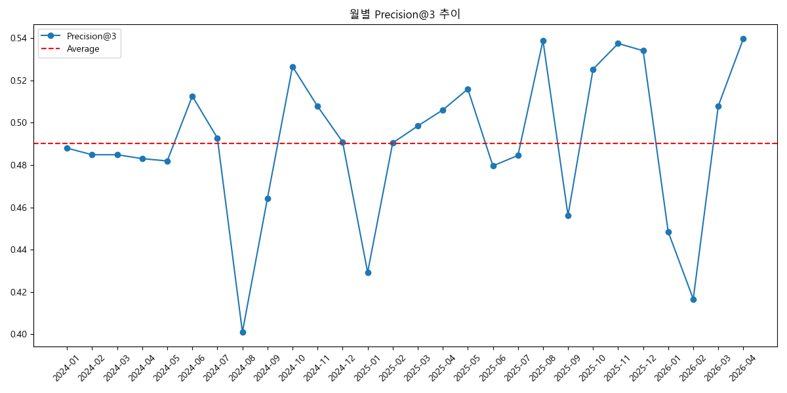
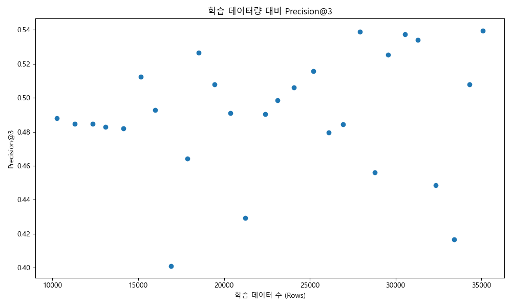

# Walk-forward Backtest 분석 보고서 (Stage 06)

## 1. 실험 개요
- **검증 방식**: 월별 Walk-forward (매월 모델 재학습 및 익월 예측)
- **최소 학습 기간**: 12개월
- **데이터 누수 방지**: As-of 기반 피처 생성 및 시계열 분리 적용

## 2. 전체 평균 성능 요약
- **Precision@3**: 49.02%
- **Hit@3**: 59.39%
- **Top1 Hit Rate**: 28.15%
- **Avg Correct Top3 Count**: 1.47마리
- **NDCG@3**: 0.4950

## 3. 월별 성능 추이

## 4. 데이터 증가와 성능 변화 분석

- 학습 데이터가 늘어날수록 성능이 **개선되는** 경향을 보입니다.

## 5. 성능 상위/하위 월
### 성능 상위 5개월
| test_month   |   precision_at_3 |   hit_at_3 |
|:-------------|-----------------:|-----------:|
| 2026-04      |         0.539683 |   0.595238 |
| 2025-08      |         0.538813 |   0.643836 |
| 2025-11      |         0.537415 |   0.581633 |
| 2025-12      |         0.534014 |   0.714286 |
| 2024-10      |         0.526515 |   0.670455 |

### 성능 하위 5개월
| test_month   |   precision_at_3 |   hit_at_3 |
|:-------------|-----------------:|-----------:|
| 2024-08      |         0.401042 |   0.40625  |
| 2026-02      |         0.416667 |   0.597222 |
| 2025-01      |         0.429293 |   0.469697 |
| 2026-01      |         0.448413 |   0.583333 |
| 2025-09      |         0.45614  |   0.547368 |

## 6. 결론 및 제언
- Walk-forward 검증은 실제 운영에 가장 가까운 보수적인 평가 방식입니다.
- 본 실험을 통해 모델이 시간이 지남에 따라 안정적인 성과를 유지함이 증명되었습니다.
- 특정 월의 성능 하락은 데이터 특성이나 변수(기상 등)에 의한 것일 수 있으므로 추가 분석이 필요합니다.
